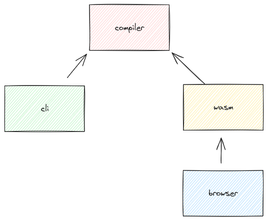

My goal for 2024 is to implement a simple programming language that
compiles to [WebAssembly](https://webassembly.org/) and that I can use
to solve at least one Advent of Code problem. In my [previous
post][previous post] I explained how I arrived at that goal.

This post lays down a rationale for choosing [Rust][rust] as the
implementation language and how I set up the project.


## Language choice

Most general-purpose programming languages can be used to implement a
compiler. So from a language perspective, it does not matter, whether
I choose Haskell, Kotlin, Java, JavaScript, TypeScript, Go, C, Rust or
Zig[^others]. However, there are a few features I would love to have
without too much hassle.

It should be possible and simple to build a static binary for a
command line interface (cli). It should also be possible to compile
the compiler to WebAssembly so that it can be used in the browser or other
languages, that support running WebAssembly programs. The language should
have good tooling (IDE, LSP, formatter, package manager) because that
just makes development much smoother and more fun.

Out of the mentioned languages, I don't know C and Zig very
much. Since this is a toy project, I could use them for the learning
experience, but I fear that I will shoot myself in the foot too often
because I never really had to think about memory management in the past. 

Java, Kotlin, JS/TS are my daily drivers which makes them boring to
use. Also in my experience, none of the CLI libraries are on par with
a library like [clap][clap] in Rust and a static binary might be
possible with [GraalVM][graal] and [Deno][deno]/[Bun][bun], but that
feels like [complecting][simple-made-easy] everything. Kotlin can be compiled to
WebAssembly but this feature is in the early stages and requires the
[GC propsal][gc], which is being implemented in browsers as far as I
know, but not fully supported.

Haskell has a brilliant ecosystem for writing compilers and a good
library for writing [clis][optparse] but compiling Haskell to
WebAssembly is still in the early stages and also requires the GC
proposal. Additionally, I never know what package manager to use
(Stack, Cabal or both?) and in the past building static binaries
always failed on me with some arcane compilation errors because of a
missing shared library. I just want this to work and it might be
better now, but I am not interested in trying it out again at the
moment.

That leaves Rust and Go. Go ticks most boxes and is a language where
the lack of abstraction compels me to write the code required to get
things done, but its lack of sum types[^sum-types] is a nonstarter for
me. Especially when talking about compiler development. I know there
are compilers written in Go, I mean the Go compiler itself is, but not
having sum types in this case feels to me like not having Vim
keybindings in an editor. As for WebAssembly, I believe Go can be
compiled into it.

Rust on the other hand has the best [CLI library][clap] of any
programming language I know, especially of languages with a type
system, can be compiled to WebAssembly and building a static binary
with [musl][musl] more or less just works. Additionally, Rust has a
good ecosystem of libraries for writing parsers[^pest], although I
don't plan to use any of them and is integrated with the WebAssembly
ecosystem.

I believe you can do all of what I want to do with any of the other
languages I mentioned here, but I feel this particular combination of
features is tied together the best by Rust. Also, I just like the
language and want to learn it more. I know it a little and hope that
by using it more, the problems I sometimes have with lifetimes will
get easier.


## Setup

Rust has a package manager called [cargo][cargo], which makes creating
a new package, called `crate` in Rust simple. For example, the
following command creates a binary crate.

```sh
$ cargo new wasp
```

However, as mentioned before, I would like to compile this program to
a static binary and to WebAssembly. To keep these different concerns
separate, there will be three crates as part of the project and one
TypeScript npm module.

- `compiler` contains the actual compiler. Ideally, the compiler is
  just a function, that I can call with a string of source code and
  that returns either a set of errors or a WebAssembly module.
- `cli` contains a command line interface for invoking the compiler
  from the command line.
- `wasm` uses [wasm-bindgen][wasm-bindgen] and [wasm-pack][wasm-pack]
  to compile Rust code to WebAssembly. *wasm-bindgen* is a tool to
  create high-level bindings so that Rust can call JS and
  vice-versa. *wasm-pack* is used to bundle the WebAssembly code so
  that it can be consumed from the web or a package manager.
- `browser` uses the WebAssembly output to use functions from the
  `compiler` in the browser.
  
Here is a quick visualization of the dependencies of these
crates/packages.



To make this work, Cargo provides [workspaces][workspaces]. That means
creating a crate works a bit differently.

```sh
$ mkdir wasp && cd wasp
$ cargo new compiler --lib 
$ cargo new cli
$ cargo new wasm --lib
```

In the `wasp` directory we can add a `Cargo.toml` with the following
content:

```toml
[workspace]

members = [
    "compiler",
    "cli",
    "browser",
]
```

Running `cargo build` in the root directory should now build all
crates. 

#### CLI

To use the `compiler` crate in another crate, it can be added
in the `[dependencies]` section of a `Cargo.toml`. For example for the
`cli` crate:

```toml
[package]
name = "wasp"
version = "0.1.0"
edition = "2021"

[dependencies]
compiler = { path = "../compiler" }
```

Now the `add` function in the `compiler` library, that was generated
by cargo during `cargo new`, can be used in the `cli` crate.

```rust
// src/main.rs
fn main() {
    println!("{}", compiler::add(5, 6));
}
```

Running this with `cargo run cli` should print `11`.

#### WebAssembly

Setting up the `wasm` crate is more involved. First
[wasm-pack][wasm-pack] and [wasm-bindgen][wasm-bindgen] have to be
installed.

```sh
$ rustup component add wasm-bindgen
$ cargo install wasm-pack
```

There are several examples in the documentation for these two tools, I
used the `Cargo.toml` from the WebAssembly starter example.

```toml
[package]
name = "browser"
version = "0.1.0"
edition = "2021"

[lib]
crate-type = ["cdylib", "rlib"]

[features]
default = ["console_error_panic_hook"]

[dependencies]
wasm-bindgen = "0.2.84"
compiler = { path = "../compiler" }

# The `console_error_panic_hook` crate provides better debugging of panics by
# logging them with `console.error`. This is great for development, but requires
# all the `std::fmt` and `std::panicking` infrastructure, so isn't great for
# code size when deploying.
console_error_panic_hook = { version = "0.1.7", optional = true }

[dev-dependencies]
wasm-bindgen-test = "0.3.34"

[profile.release]
# Tell `rustc` to optimize for small code size.
opt-level = "s"
```

With this it is possible to build a `.wasm` file, that can be used for
example in [vite][vite]. To try this out add the following to
`wasm/src/lib.rs` file:

```rust
use wasm_bindgen::prelude::wasm_bindgen;

#[wasm_bindgen]
pub fn add(a: usize, b: usize) -> usize {
    compiler::add(a, b)
}
```

Build it:

```sh
$ cd wasm && wasm-pack build --target bundler
$ cd ../
```

Then create a vite project and configure
[vite-plugin-wasm](https://www.npmjs.com/package/vite-plugin-wasm). There
are other plugins that can be
[used](https://github.com/nshen/vite-plugin-wasm-pack), but they seem
to be comparatively old and I haven't tried them.

```sh
$ npm create vite@latest browser
$ cd browser
$ npm install
$ npm install --save-dev vite-plugin-wasm vite-plugin-top-level-await
```

Configure the build in the `vite.config.ts`:

```ts
import { defineConfig } from 'vite'
import react from '@vitejs/plugin-react'
import wasm from 'vite-plugin-wasm';
import topLevelAwait from 'vite-plugin-top-level-await';

// https://vitejs.dev/config/
export default defineConfig({
  plugins: [react(), wasm(), topLevelAwait()],
})
```

And use it.

```typescript
import { add } from '../wasm/pkg/browser_bg.wasm';

console.log(add(5, 6));
```


## Conclusion

This post is quite long and explained my rationale for choosing Rust
and how I setup the project. You can see all the code
[here](https://github.com/noobymatze/wasp). I hope this keeps working,
but there are probably some gotchas in the near future, especially
concerning the WebAssembly integration.

Next week will take a look at the language I would like to write or
maybe I am starting off with a lexer.

Happy week!


[previous post]: /posts/2024/happy-new-year
[rust]: https://www.rust-lang.org/
[haskell]: https://www.haskell.org/
[zig]: https://ziglang.org/
[kotlin]: https://kotlinlang.org/
[ocaml]: https://ocaml.org/
[workspaces]: https://doc.rust-lang.org/book/ch14-03-cargo-workspaces.html
[wasm-guide]: https://rustwasm.github.io/
[wasm-pack]: https://rustwasm.github.io/docs/wasm-pack/
[wasm-bindgen]: https://rustwasm.github.io/docs/wasm-bindgen/
[wasm-deployment]: https://rustwasm.github.io/wasm-bindgen/reference/deployment.html
[clap]: https://clap.rs
[cargo]: https://doc.rust-lang.org/cargo/
[vite]: https://vitejs.dev/
[gc]: https://github.com/WebAssembly/gc
[musl]: https://github.com/kraj/musl
[optparse]: https://hackage.haskell.org/package/optparse-applicative
[graal]: https://www.graalvm.org/
[deno]: https://deno.com/
[bun]: https://bun.sh/
[simple-made-easy]: https://www.youtube.com/watch?v=SxdOUGdseq4

[^pest]: I love [PEST](https://pest.rs/), it's just so much fun to define grammars with it. Highly recommended!
[^others]: Of course there are other languages (Clojure, Racket,
    Elixir, C#, F#, C++), but I don't feel like I know enough about them to assess whether they would annoy me.
[^sum-types]: Sum types are essentially enums which can have instance variables for a variant.
