Okay, missed the deadline last weekend, the previous week was so full
of lessons, I don't even know where to begin. Here are a couple.

## Thesis

In the past 10 years, I have repeatedly helped people with their
theses. There are three patterns I see every time with people who are
new to writing a thesis.

#### Using personal pronouns

Using "I" or "we". This is common in some papers with multiple
authors, but if you are not publishing in a journal, avoid this as
much as possible. You are reporting facts or observations and drawing
conclusions from those facts, not writing an experience report.

Here is an example, instead of

> We can take a look at the following code snippet.

Write:

> The following code snippet illustrates the previous point.


#### Structure

The structure is even more important, but that takes some thought. I
tend to think of it mostly as dependencies between chapters. 

Imagine you were a detective on a crime show and your subjects would
be chapters. Would your cork board look like a mess with red threads
spanning all over the place or would you rather have something
tree-shaped, that you can follow easily from start to finish?
Something like this:



This shape is just an example, and in a real thesis you will probably
have to reference something, before you have defined what it is or you
will have more dependencies between sections of each chapter. The
point is to think about these things.

As a programmer I view a thesis and a paper in general, through the
lens of functions.

```javascript
const myPaper = (worldKnowledge) => {
    const [introKnowledge, motivation] = intro(worldKnowledge);
    const basics1 = chapter1(introKnowledge, worldKnowledge);
    const basics2 = chapter2(introKnowledge, worldKnowledge);
    const result = chapter3(basics1, basics2, worldKnowledge);
    const conclusion = conclusion(introKnowledge, motiviation, result);
    return conclusion
};

```

We, as the authors take the knowledge of the world and write different
functions to extract the required knowledge and build new knowledge on
top of it.


#### Making the structure clear

This ties back to the previous section. Since text is linear, you
should try to make the structure of your paper clear by telling the
reader about it. This also helps a reader keep track of the common
thread or throughline (not sure how to properly translate "roter
Faden" to English).

For example, in chapter 1 you might say:

> This chapter defines technical terms in social sciences, that are
> used throughout this paper. It also explains how they relate to the
> research question of this paper.

You could even think about briefly listing the terms you are going to
discuss. That way, if I, as the reader know all these terms, I can
just skip them.

At the end of each chapter, a small summary is pretty neat.

> This chapter defined the term X, which means ... and also Y and
> Z. These are relevant because following chapter will use these terms
> to make something beautiful.


## Working with AI

There was a fantastic [blog post][ai], which I found very enlightening
and promptly tried out.

I just asked GPT4o to ask me questions about creating a log parser for
python in rust. Then I used o1 to decompose the resulting summary into
different steps and then let it build it. I copy-pasted the code and
it just required a simple tweak and worked almost on first try.

That's a great technique, if you want something quick and dirty but
don't really care for the result that much.


## Code duplication

This is a heated topic. Many people follow DRY religiously. My rule of
thumb is if code pops up three times, you should probably clean it up.

But there is another side to this, that doesn't get nearly discussed
as much, and that is, sometimes some logic and code just looks like
it's the same and does the same, but the context is totally
different. In that case, drying the code up, will lead to bugs later
on.

All that is to say, that there are trade-offs either way. Not drying
up code might lead to bugs and hard to find things. Drying it up,
might also lead to bugs.


## rm -rf is bad

I accidentally deleted some production data, which we could recover,
but a friendly reminder to use `mv` instead of `rm -rf` if you want to
delete something.


## Code style

At work, we were discussing the following kind of code.

```kotlin
if (a == 5 && b != 7) {
    // do stuff
} else if (a == 5) {
    // do stuff
}
```

This looks simple enough, but its weakness is, that you need to check
`a == 5` two times and if one of the places changes, you might miss
the other spot. Especially if you have not been working with this
piece of code for a long time.

I was reminded of the code style from [TigerBeetle][tiger], where they
advocate for defining these conditions in the following way.


```kotlin
if (a == 5) {
    if (b != 7) {
    } else {
    }
} else {
}
```

Ten years ago, I would have been completely opposed to this kind of
code. Today, I think it actually does have some really practical
benefits:

- The dependency between the two values is obvious.
- It's clear, if an else block is missing.
- If there should be error handling in both `else` blocks, just
  extract a function and reuse it.

So, question your assumptions about how to structure code at every
turn. And read the [code style from TigerBeetle][tiger].

Cheers!


[tiger]: https://github.com/tigerbeetle/tigerbeetle/blob/main/docs/TIGER_STYLE.md
[ai]: https://harper.blog/2025/02/16/my-llm-codegen-workflow-atm/
